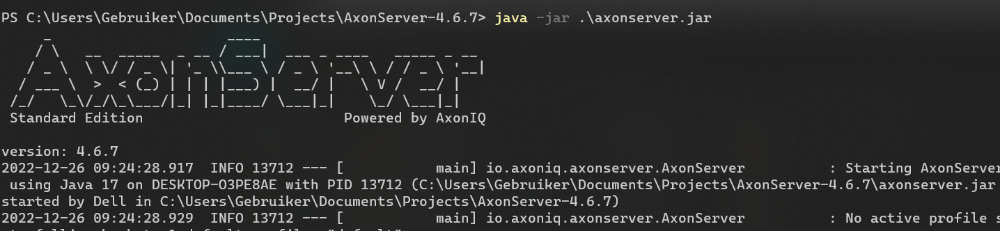
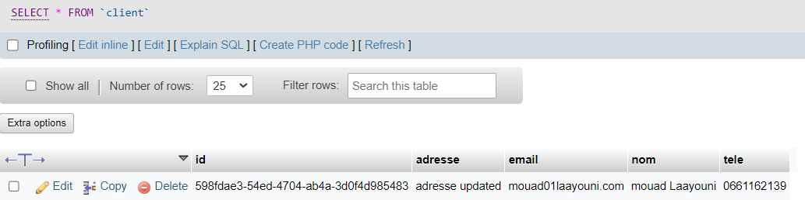

# Examen
- [Examen](#examen)
  - [Architecture](#architecture)
  - [Class diagram](#class-diagram)
  - [Axon Server](#axon-server)
  - [Common-API](#common-api)
  - [DiscoveryService](#discoveryservice)
  - [GatewayService](#gatewayservice)
  - [CustomerService](#customerservice)
    - [1. Dependencies :](#1-dependencies-)
    - [2. CommandSide](#2-commandside)
      - [1. create clientCommand Controller](#1-create-clientcommand-controller)
      - [2. create necessary commands, dtos, events in common-API:](#2-create-necessary-commands-dtos-events-in-common-api)
      - [3. in the same way we create for update Client](#3-in-the-same-way-we-create-for-update-client)
      - [4. create ClientAggregate](#4-create-clientaggregate)
    - [3. QuerySide](#3-queryside)
      - [1. ClientQueryController](#1-clientquerycontroller)
      - [2. Client entity](#2-client-entity)
      - [3. Client Repo](#3-client-repo)
      - [4. ClientServiceHandler](#4-clientservicehandler)
    - [4. properties](#4-properties)
    - [5. Tests:](#5-tests)
  - [InventoryService](#inventoryservice)
    - [1. Service Structure](#1-service-structure)
    - [2. Entities](#2-entities)
      - [1. Category](#1-category)
      - [2. Produit](#2-produit)
    - [5. Tests:](#5-tests-1)

## Architecture

## Class diagram

## Axon Server
- started Axon server : 
## Common-API
Where we will put the common used classes : 
## DiscoveryService
1. add annotation to main dependency
```java
@SpringBootApplication
@EnableEurekaServer
public class DiscoveryServiceApplication {

	public static void main(String[] args) {
		SpringApplication.run(DiscoveryServiceApplication.class, args);
	}

}
```
2. application.properties:
```properties
server.port=8761
eureka.instance.prefer-ip-address=true
eureka.client.fetch-registry=false
eureka.client.register-with-eureka=false
```
## GatewayService 
1. Create GatewayConfig:
```java
@Configuration
public class GatewayConfig {
    @Bean
    DiscoveryClientRouteDefinitionLocator discoveryClientRouteDefinitionLocator(ReactiveDiscoveryClient reactiveDiscoveryClient,
                                                                                DiscoveryLocatorProperties discoveryLocatorProperties){
        return new DiscoveryClientRouteDefinitionLocator(reactiveDiscoveryClient, discoveryLocatorProperties);
    }
}
```
2. application.properties:
```properties
eureka.client.register-with-eureka=true
server.port=7000
spring.application.name=GATEWAY-SERVICE
```

## CustomerService
### 1. Dependencies :
  - eureka-client
  - jpa
  - web
  - lombok
  - MySQL
  - Axon
  - add Common-API to the dependencies 
        ```xml
        <dependency>
			<groupId>org.example</groupId>
			<artifactId>Common-API</artifactId>
			<version>1.0-SNAPSHOT</version>
		</dependency>
        ```
### 2. CommandSide
####  1. create clientCommand Controller
```java
        @RestController
@RequestMapping("/commands/client")
@AllArgsConstructor
public class ClientCommandController {
    private final CommandGateway commandGateway;
    private final EventStore eventStore;

    @PostMapping("/create")
    public CompletableFuture<String> createClient(@RequestBody CreateClientRequestDTO request) {
        return commandGateway.send(new CreateClientCommand(
                UUID.randomUUID().toString(),
                request.getNom(),
                request.getAdresse(),
                request.getEmail(),
                request.getTele()
        ));
    }

    @PutMapping("/update")
    public CompletableFuture<String> updateClient(@RequestBody UpdateClientRequestDTO request) {
        return commandGateway.send(new UpdateClientCommand(
                request.getId(),
                request.getNom(),
                request.getAdresse(),
                request.getEmail(),
                request.getTele()
        ));
    }
}
```
#### 2. create necessary commands, dtos, events in common-API:
      - CreateClientCommand
```java
public class CreateClientCommand extends BaseCommand<String> {
  @Getter private String nom;
    @Getter private String adresse;
    @Getter private String email;
    @Getter private String tele;

    public CreateClientCommand(String id, String nom, String adresse, String email, String tele) {
        super(id);
        this.nom = nom;
        this.adresse = adresse;
        this.email = email;
        this.tele = tele;
    }
}
```
      - CreateClientDTO
```java
@Data
@AllArgsConstructor
@NoArgsConstructor
public class CreateClientRequestDTO {
    private String nom;
    private String adresse;
    private String email;
    private String tele;
}
```
      - ClientCreatedEvent
```java
public class ClientCreatedEvent extends BaseEvent<String> {
  @Getter private String nom;
    @Getter private String adresse;
    @Getter private String email;
    @Getter private String tele;

    public ClientCreatedEvent(String id, String nom, String adresse, String email, String tele) {
        super(id);
        this.nom = nom;
        this.adresse = adresse;
        this.email = email;
        this.tele = tele;
    }
}
```
#### 3. in the same way we create for update Client
#### 4. create ClientAggregate
```java
@Aggregate
public class ClientAggregate {
    @AggregateIdentifier
    private String id;
    private String nom;
    private String adresse;
    private String email;
    private String tele;

    public ClientAggregate() {
    }

    @CommandHandler
    public ClientAggregate(CreateClientCommand command) {
        AggregateLifecycle.apply(new ClientCreatedEvent(
                command.getId(),
                command.getNom(),
                command.getAdresse(),
                command.getEmail(),
                command.getTele()
        ));
    }

    @EventSourcingHandler
    public void on(ClientCreatedEvent event) {
        this.id = event.getId();
       this.adresse= event.getAdresse();
       this.email= event.getEmail();
       this.nom= event.getNom();
       this.tele= event.getTele();
    }

    @CommandHandler
    public void handle(UpdateClientCommand command) {
        AggregateLifecycle.apply(new ClientUpdatedEvent(
                command.getId(),
                command.getNom(),
                command.getAdresse(),
                command.getEmail(),
                command.getTele()
        ));
    }

    @EventSourcingHandler
    public void on(ClientUpdatedEvent event) {
        this.id = event.getId();
        this.adresse= event.getAdresse();
        this.email= event.getEmail();
        this.nom= event.getNom();
        this.tele= event.getTele();
    }
}
```
### 3. QuerySide
#### 1. ClientQueryController
```java
@RestController
@RequestMapping("/queries/client")
@AllArgsConstructor
@Slf4j
public class ClientQueryController {
    private QueryGateway queryGateway;

    @GetMapping("/allClients")
    public List<Client> ClientsList() {
        List<Client> response = queryGateway.query(new GetAllClientsQuery(), ResponseTypes.multipleInstancesOf(Client.class)).join();
        return response;
    }

    @GetMapping("/byId/{id}")
    public List<Client> ClientByIdList(@PathVariable String id){
        List<Client> response = queryGateway.query(new GetClientByIdQuery(id), ResponseTypes.multipleInstancesOf(Client.class)).join();
        return response;
    }
}
```
#### 2. Client entity
```java
@Entity
@Data
@AllArgsConstructor
@NoArgsConstructor
public class Client {
    @Id
    private String id;
    private String nom;
    private String adresse;
    private String email;
    private String tele;
}
```
#### 3. Client Repo
```java
public interface ClientRepository extends JpaRepository<Client,String> {
}
```
#### 4. ClientServiceHandler
```java
@Service
@AllArgsConstructor
@Slf4j
@Transactional
public class ClientServiceHandler {
    private ClientRepository clientRepository;
    @EventHandler
    public void on(ClientCreatedEvent event) {
        log.info("ClientCreatedEvent received");
        Client client = new Client();
        client.setId(event.getId());
        client.setAdresse(event.getAdresse());
        client.setEmail(event.getEmail());
        client.setNom(event.getNom());
        client.setTele(event.getTele());
        clientRepository.save(client);
    }
    @EventHandler
    public void on(ClientUpdatedEvent event) {
        log.info("ClientUpdatedEvent received");

        Client client = clientRepository.findById(event.getId()).get();
        client.setAdresse(event.getAdresse());
        client.setEmail(event.getEmail());
        client.setNom(event.getNom());
        client.setTele(event.getTele());
        clientRepository.save(client);
    }
    @QueryHandler
    public List<Client> on(GetAllClientsQuery query){
        return clientRepository.findAll();
    }

    @QueryHandler
    public Client on(GetClientByIdQuery query){
        return clientRepository.findById(query.getId()).get();
    }
}
```
### 4. properties
```properties
spring.application.name=CUSTOMER-SERVICE
spring.datasource.url=jdbc:mysql://${MYSQL_HOST:localhost}:${MYSQL_HOST:3306}/customerDB?createDatabaseIfNotExist=true
spring.datasource.username=${MYSQL_USER:root}
spring.datasource.password=${MYSQL_PASSWORD:}
spring.jpa.hibernate.ddl-auto=update
spring.jpa.properties.hibernate.dialect=org.hibernate.dialect.MariaDBDialect
server.port=7001
# default parameter :
axon.axonserver.servers=localhost
axon.axonserver.enabled=true
eureka.instance.prefer-ip-address=true
spring.cloud.discovery.enabled=true
```
Customer Service is UP:
### 5. Tests:
   1. Create CLient : 
   2. In database : 
   3. update client:   
   4. In database:    
   5. Get All Clients:    
   6. Get Client By Id:     

## InventoryService
### 1. Service Structure
the same method as the Customer Service : 
### 2. Entities
#### 1. Category
```java
@Entity
@Data
@AllArgsConstructor
@NoArgsConstructor
public class Category {
    @Id
    private String category_id;
    private String nom;
    private String desc;

    @OneToMany(mappedBy = "category")
    @JsonProperty(access = JsonProperty.Access.WRITE_ONLY)
    private List<Produit> produits;
}
```
#### 2. Produit
```java
@Entity
@Data
@AllArgsConstructor
@NoArgsConstructor
public class Produit {
    @Id
    private String id;
    private String nom;
    private double prix;
    private int quantite;
    @ManyToOne
    private Category category;
}
```

### 5. Tests:
   1. Create Category : 

